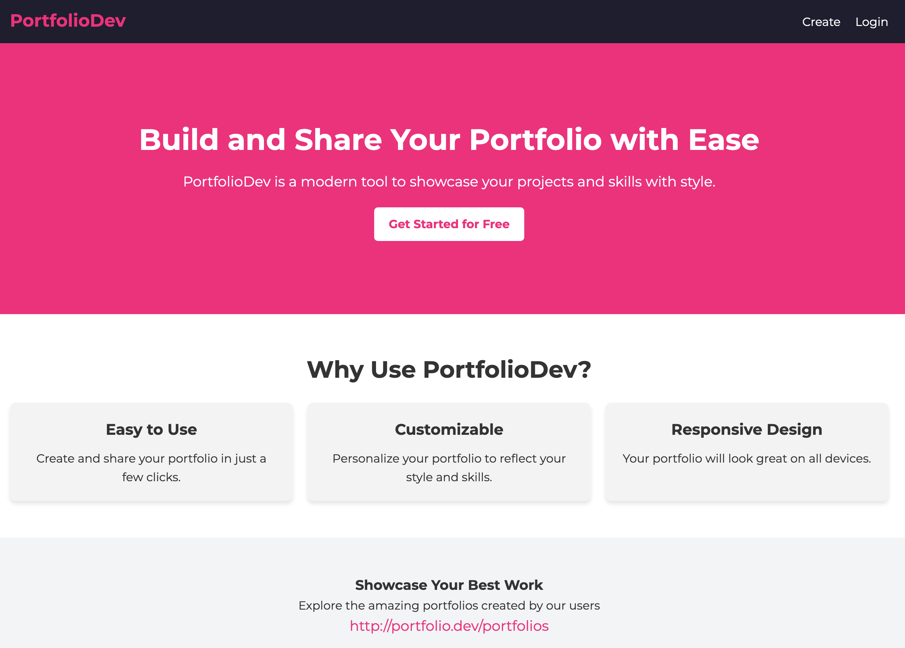
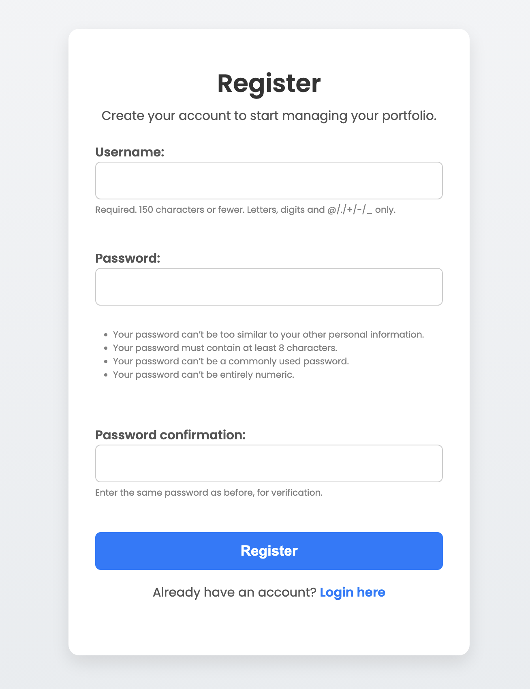
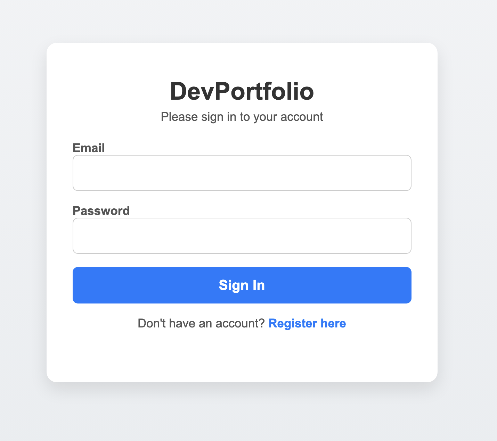
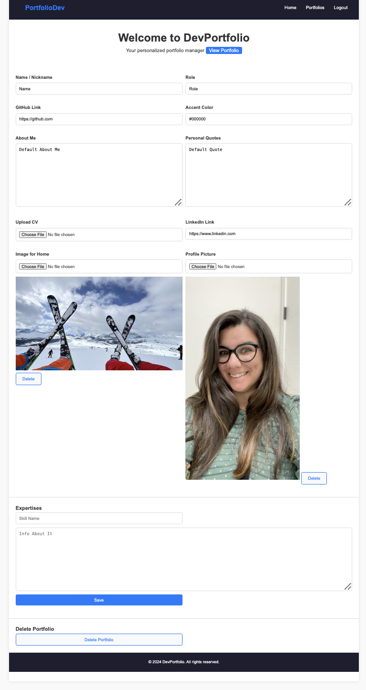
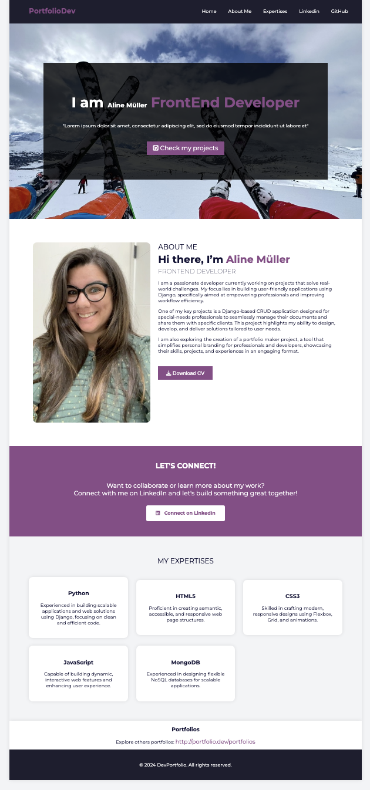

# DevPortfolio

DevPortfolio is a Django-based web application that allows users to create and manage their personal portfolios. Users can add their personal information, skills, and other relevant details to showcase their professional profiles.

 
*Homepage of DevPortfolio*
 
*Register*
 
*Login*
 
*CMS for manage Portfolio*
 
*Example of a user portfolio*
 
*List of Portfolios*

## Features

- User authentication (registration, login, logout)
- Create and edit personal portfolios
- Add and manage skills
- Upload profile and home pictures
- Customize portfolio with accent colors
- Responsive design

## Technologies Used

- Django
- HTML/CSS
- JavaScript
- SQLite (default database)
- Bootstrap (for responsive design)