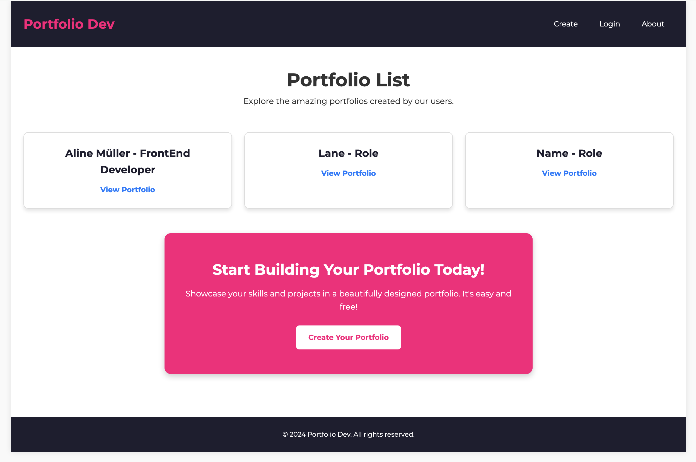

# DevPortfolio

DevPortfolio is a Django-based web application that allows users to create and manage their personal portfolios. Users can add their personal information, skills, and other relevant details to showcase their professional profiles.

*Register*

*Login*

*CMS to manage Portfolio*

*Example of a user portfolio*

*List of Portfolios*

## Features

- User authentication (registration, login, logout)
- Create and edit personal portfolios
- Add and manage skills
- Upload profile and home pictures
- Customize portfolio with accent colors
- Responsive design

## Technologies Used

- Django
- HTML/CSS
- JavaScript
- SQLite (default database)
- Bootstrap (for responsive design)

## Deployed App

Check out the live version of PortfolioDev: [PorfolioDev](https://portfolio-dev-app-cd559d6f6e18.herokuapp.com/about/)

## Planning Materials

Wireframes and User Stories: [Planning Document](https://trello.com/b/SCNfhtfJ/devportfolio)